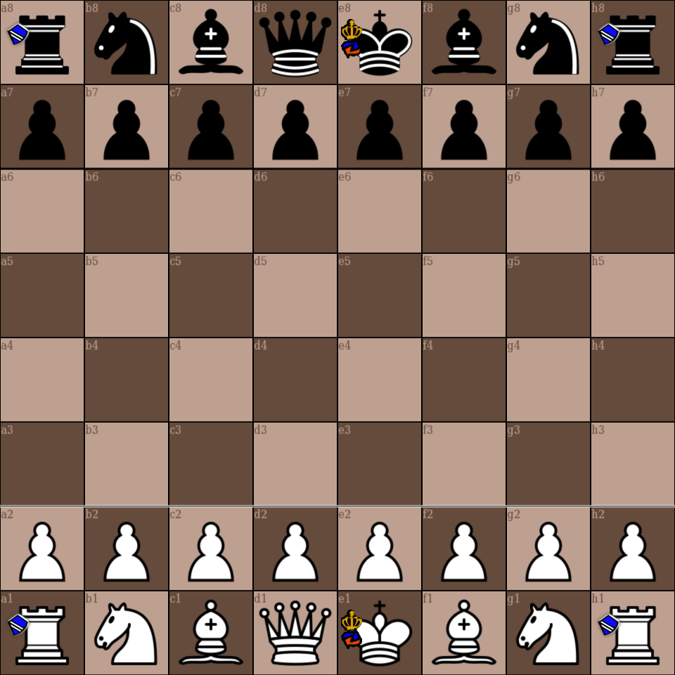
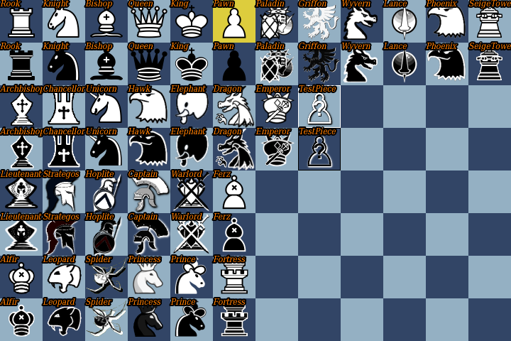
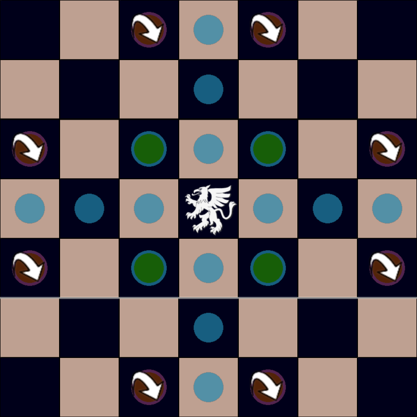
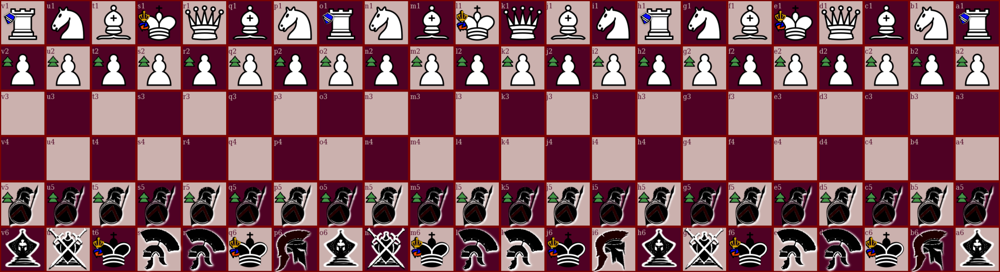
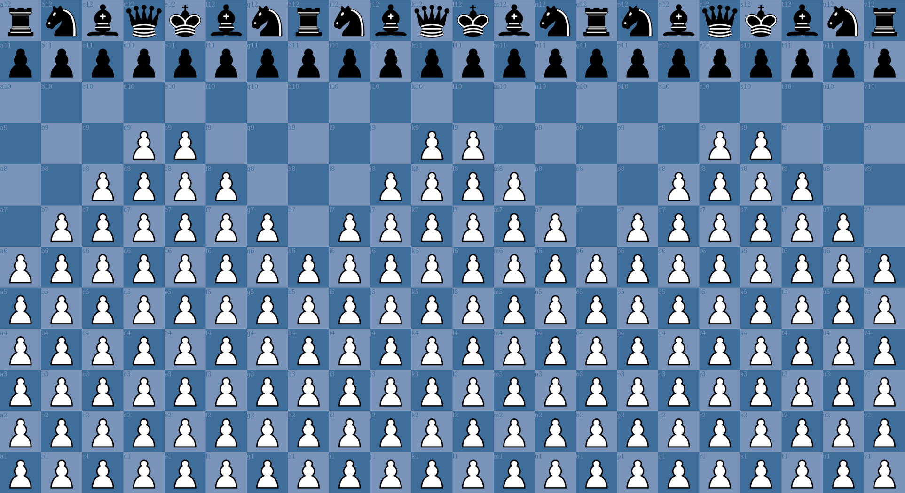
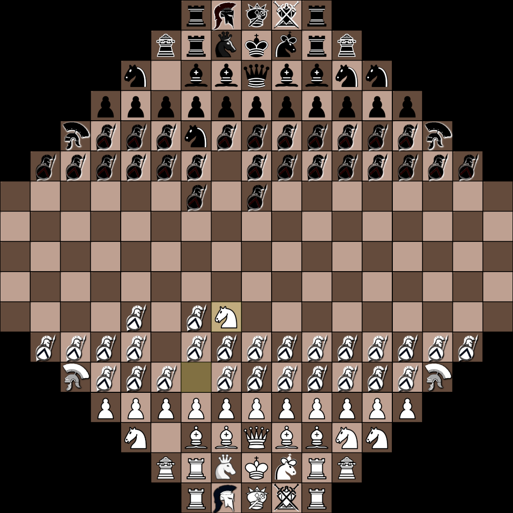
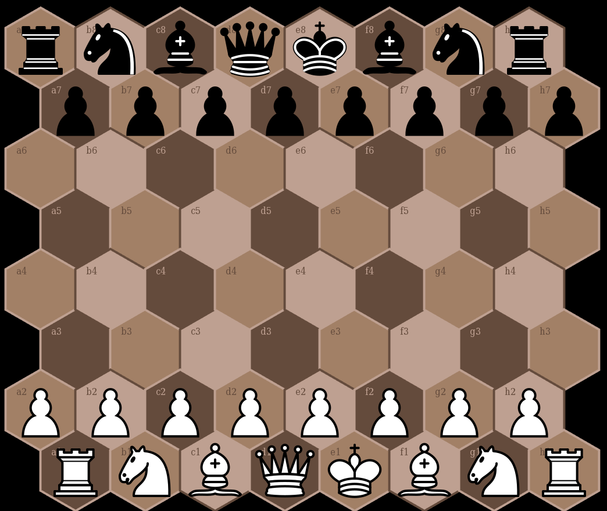
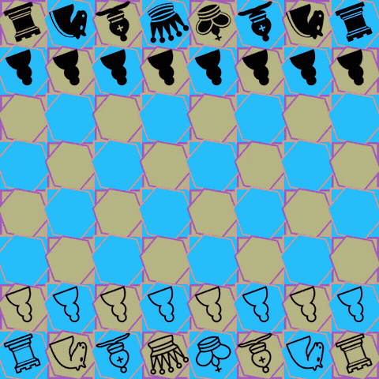
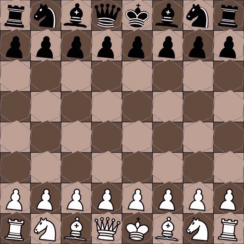

A Chess Program
===============

My first program. \
<i>Still unfinished...</i>

## Prerequisites

GCC-13 and Boost libraries

## Screenshots

|                                                   |                                                     |
|---------------------------------------------------|-----------------------------------------------------|
|  |  |

|                                                       |                                                     |
|-------------------------------------------------------|-----------------------------------------------------|
|  |  |

