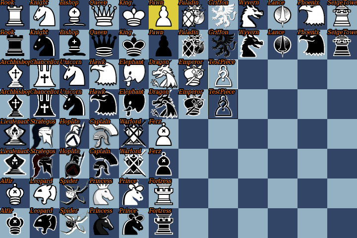
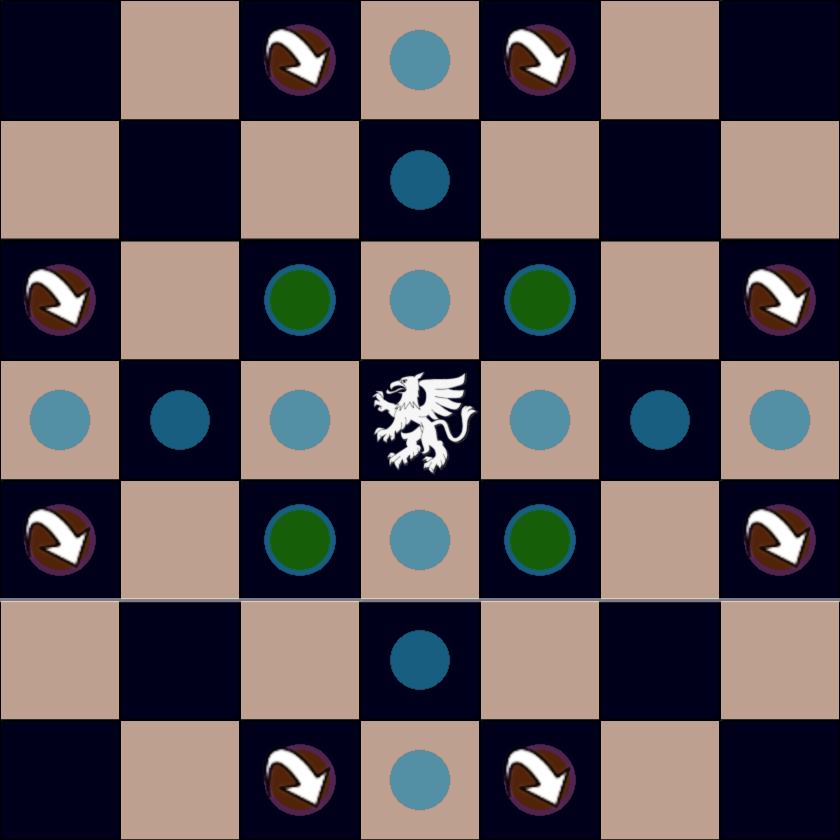
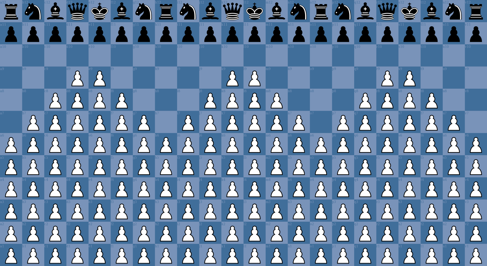

A Chess Program
===============

My first program. \
<i>Still unfinished...</i>

## Prerequisites

GCC-10 or later \
Boost libraries \
SFML 2.5+

Thor (SFML extension library) \
This repo includes 'libthor.so'; If you can link to this you don't need to install Thor. \
If your SFML version is not 2.6, you will probably need to recompile libthor.so (good luck) \
If you recompile/install Thor yourself, replace the header files included under 'Bromeon'

## Screenshots

|                                                   |                                                     |
|---------------------------------------------------|-----------------------------------------------------|
|  |  |

